# BookShelf 書籍レビューアプリ

ユーザーが書籍を登録・閲覧し、レビューやお気に入りを共有できる書籍レビューアプリです。
書籍のジャンル分類、レビューへのいいね、平均評価ランキング、読書計画、読書状況のレポートなど、読書を継続するための機能を提供します。

## 作成者

金沢 光汰

## 使用技術

- PHP 8.5
- Laravel 10.x
- MySQL 8.4
- Nginx
- Docker / Docker Compose / Laravel Sail
- Vite / Tailwind CSS 3.4
- Laravel Fortify（認証）
- Laravel Sanctum（API トークン認証）
- Google Books API
- phpMyAdmin

## ER図

```mermaid
erDiagram
    users {
        bigint_unsigned id PK
        varchar_255 name
        varchar_255 email UK
        timestamp email_verified_at
        varchar_255 password
        text two_factor_secret
        text two_factor_recovery_codes
        timestamp two_factor_confirmed_at
        varchar_100 remember_token
        timestamp created_at
        timestamp updated_at
    }

    books {
        bigint_unsigned id PK
        bigint_unsigned user_id FK
        varchar_255 title
        varchar_100 author
        varchar_13 isbn UK "nullable"
        date published_date "nullable"
        varchar_1000 description
        varchar_255 image_url
        timestamp created_at
        timestamp updated_at
    }

    genres {
        bigint_unsigned id PK
        varchar_100 name UK
        timestamp created_at
        timestamp updated_at
    }

    book_genre {
        bigint_unsigned id PK
        bigint_unsigned book_id FK
        bigint_unsigned genre_id FK
        timestamp created_at
        timestamp updated_at
    }

    reviews {
        bigint_unsigned id PK
        bigint_unsigned book_id FK
        bigint_unsigned user_id FK
        tinyint rating
        varchar_255 comment
        timestamp created_at
        timestamp updated_at
    }

    favorites {
        bigint_unsigned id PK
        bigint_unsigned user_id FK
        bigint_unsigned book_id FK
        timestamp created_at
        timestamp updated_at
    }

    review_likes {
        bigint_unsigned id PK
        bigint_unsigned review_id FK
        bigint_unsigned user_id FK
        timestamp created_at
        timestamp updated_at
    }

    reading_plans {
        bigint_unsigned id PK
        bigint_unsigned user_id FK
        bigint_unsigned book_id FK
        date target_date
        tinyint status
        date completed_at
        timestamp created_at
        timestamp updated_at
    }

    notifications {
        uuid id PK
        varchar_255 type
        varchar_255 notifiable_type
        bigint_unsigned notifiable_id
        text data
        timestamp read_at
        timestamp created_at
        timestamp updated_at
    }

    personal_access_tokens {
        bigint_unsigned id PK
        varchar_255 tokenable_type
        bigint_unsigned tokenable_id
        varchar_255 name
        varchar_64 token UK
        text abilities
        timestamp last_used_at
        timestamp expires_at
        timestamp created_at
        timestamp updated_at
    }

    users ||--o{ books : "registers"
    users ||--o{ reviews : "posts"
    users ||--o{ favorites : "adds"
    users ||--o{ review_likes : "likes"
    users ||--o{ reading_plans : "creates"
    users ||--o{ notifications : "receives"
    users ||--o{ personal_access_tokens : "owns"
    books ||--o{ reviews : "has"
    books ||--o{ favorites : "is favorited"
    books ||--o{ book_genre : "belongs to"
    genres ||--o{ book_genre : "classifies"
    reviews ||--o{ review_likes : "receives"
    books ||--o{ reading_plans : "is planned"
```



`book_genre`、`favorites`、`review_likes` には、それぞれの外部キーの組み合わせにユニーク制約を設定しています。

## 開発環境URL

[http://localhost](http://localhost)

## 動作環境

- Docker
- Docker Compose

※ Windows の場合は WSL2 の利用を推奨します。

## 環境構築手順

1. **リポジトリをクローン**

    ```bash
    git clone https://github.com/ka3gio/bookshelf-review-app.git
    cd bookshelf-review-app
    ```

2. **`.env` ファイルの準備**

    `.env.example` をコピーして `.env` を作成します。

    ```bash
    cp .env.example .env
    ```

    `.env` ファイルのアプリケーション名、URL、DB 接続情報を以下のように設定します。

    ```ini
    APP_NAME=BookShelf
    APP_URL=http://localhost

    DB_CONNECTION=mysql
    DB_HOST=mysql
    DB_PORT=3306
    DB_DATABASE=laravel
    DB_USERNAME=sail
    DB_PASSWORD=password
    ```

    ISBN 検索機能を使用する場合は、Google Cloud で取得した API キーも設定してください。

    ```ini
    GOOGLE_BOOKS_API_KEY=取得したAPIキー
    ```

3. **Composer 依存パッケージのインストール**

    初回セットアップ時は `vendor` ディレクトリが存在せず Sail を使用できないため、Docker コンテナ内で Composer を実行します。

    ```bash
    docker run --rm \
        -u "$(id -u):$(id -g)" \
        -v "$(pwd):/var/www/html" \
        -w /var/www/html \
        -e COMPOSER_CACHE_DIR=/tmp/composer_cache \
        laravelsail/php82-composer:latest \
        composer install --ignore-platform-reqs
    ```

4. **Laravel Sail の起動**

    ```bash
    ./vendor/bin/sail up -d
    ```

    以降の手順では、次のエイリアスを設定済みであることを前提に `sail` と表記します。

    ```bash
    alias sail='[ -f sail ] && bash sail || bash vendor/bin/sail'
    ```

    Apple Silicon 環境で MySQL イメージのエラーが発生する場合は、`compose.yaml` の `mysql` サービスに `platform: linux/amd64` を追加してください。

5. **アプリケーションキーの生成**

    ```bash
    sail artisan key:generate
    ```

6. **データベースのマイグレーションと初期データ投入**

    以下のコマンドでテーブルを作成し、ダミーデータを投入します。

    ```bash
    sail artisan migrate:fresh --seed
    ```

7. **フロントエンドのビルド**

    ```bash
    sail npm install
    sail npm run dev
    ```

    `npm run dev` は開発中は起動したままにしてください。

8. **アプリケーションへのアクセス**

    ブラウザで [http://localhost](http://localhost) にアクセスします。

## 初期ログイン情報

シーディング実行後は、以下のいずれかのユーザーでログインできます。パスワードはすべて `password` です。

| ユーザー名 | メールアドレス        |
| ---------- | --------------------- |
| 山田太郎   | yamada@example.com    |
| 鈴木花子   | suzuki@example.com    |
| 田中一郎   | tanaka@example.com    |
| 佐藤美咲   | sato@example.com      |
| 高橋健太   | takahashi@example.com |

## リマインダー通知

読書計画の期限確認コマンドは、毎日 7:00（Asia/Tokyo）に実行されるよう登録されています。ローカル環境でスケジューラーを継続実行する場合は、別のターミナルで以下を実行してください。

```bash
sail artisan schedule:work
```

期限確認だけを手動実行する場合:

```bash
sail artisan app:check-reading-plan-deadlines
```

## テスト実行

```bash
sail artisan test
```

カバレッジ付きで実行する場合:

```bash
sail artisan test --coverage
```

## 機能一覧

- ユーザー登録・ログイン・ログアウト
- 書籍の登録・一覧・詳細・編集・削除
- キーワード検索、ジャンル絞り込み、並び替え
- ISBN-13 を利用した Google Books API からの書籍情報取得
- レビューの投稿・編集・削除
- レビューへのいいね・いいね解除
- お気に入りの登録・解除・一覧表示
- ジャンルの登録・一覧・編集・削除
- 平均評価に基づく書籍ランキング
- 読書冊数・レビュー数・平均評価・ジャンル別冊数などのマイ読書レポート
- 読書計画の登録・編集・削除・進行中への変更・読了
- 読書計画の期限前・当日・期限超過通知
- 書籍 CRUD の REST API
- Laravel Sanctum による API トークン発行・認証
- Policy による書籍・レビュー・読書計画の認可

## APIエンドポイント一覧

すべてのエンドポイントは `/api/v1` プレフィックス配下に定義されています。

| HTTPメソッド | URI                    | 認証    | 概要                                                           |
| ------------ | ---------------------- | ------- | -------------------------------------------------------------- |
| POST         | `/api/v1/tokens`       | 不要    | メールアドレスとパスワードから API トークンを発行              |
| GET          | `/api/v1/books`        | 不要    | 書籍一覧を取得（検索・ジャンル絞り込み・ページネーション対応） |
| GET          | `/api/v1/books/{book}` | 不要    | 書籍詳細を取得                                                 |
| POST         | `/api/v1/books`        | Sanctum | 書籍を新規登録                                                 |
| PUT / PATCH  | `/api/v1/books/{book}` | Sanctum | 所有する書籍を更新                                             |
| DELETE       | `/api/v1/books/{book}` | Sanctum | 所有する書籍を削除                                             |

### APIトークンの発行

```bash
curl -X POST http://localhost/api/v1/tokens \
    -H "Accept: application/json" \
    -H "Content-Type: application/json" \
    -d '{
        "email": "yamada@example.com",
        "password": "password"
    }'
```

レスポンスの `token` を、書き込み系 API の `Authorization` ヘッダーに指定します。

```http
Authorization: Bearer 発行されたトークン
Accept: application/json
Content-Type: application/json
```

## 仕様変更・追加事項

設計書に記載されていない変更・追加仕様を以下に記載します。

- 書籍一覧においてレビュー無い場合、星および評価は表示しないようにしました。
- 書籍計画一覧において計画を未着手から進行中にするため、「進行中にする」リンクを追加しました。
